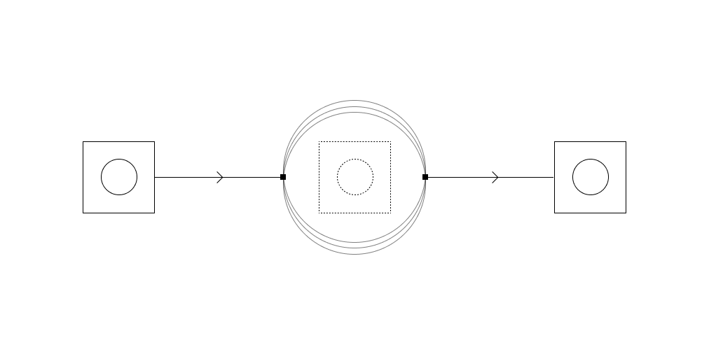

# Zora — Auction House 〜 𓀨 〜



The Zora Auction House is an open and permissionless system that allows any creator, community, platform or DAO to create and run their own curated auction houses. 

These auction houses run reserve timed auctions for NFTs, with special emphasis given to the role of curators. If an owner of an NFT chooses to list with a curator, that curator can charge a curator fee and has to approve any auction before it commences with that curators auction house. 

Anyone is able to run an NFT auction on the protocol for free by simply not specifying a curator.

The Zora ethos is to create public goods that are either owned by the community or by no one. As such, we have deployed this without admin functionality, and is therefore entirely permissionless and unstoppable.

*Mainnet address:* `0x3f7B02844c6A4DED0e156A0372DcBea89C6FEc88`

*Rinkeby address:* `0xd8De6F17E614229886b3A60d5537A268FEacbF3A`

## Table of Contents
- [Architecture](#architecture)
  - [Curators](#curators)
  - [Create Auction](#create-auction)
  - [Cancel Auction](#cancel-auction)
  - [Set Auction Approval](#set-auction-approval)
  - [Create Bid](#create-bid)
  - [End Auction](#end-auction)
- [Local Development](#local-development)
  - [Install Dependencies](#install-dependencies)
  - [Compile Contracts](#compile-contracts)
  - [Run Tests](#run-tests)
- [Bug Bounty](#bug-bounty)
- [Acknowledgements](#acknowledgements)

## Architecture
This protocol allows a holder of any NFT to create and perform
a permissionless reserve auction. It also acknowledges the role of
curators in auctions, and optionally allows the auction creator to 
dedicate a portion of the winnings from the auction to a curator of their choice.

Note that if a curator is specified, the curator decides when to start the auction. 
Additionally, the curator is able to cancel an auction before it begins.

### Curators
In a metaverse of millions of NFTs, the act of curation is critical. Curators create and facilitate context and community which augment the value of NFTs that they select. The act of curation creates value for the NFT by contextualizing it and signalling its importance to a particular community. The act of curation is extremely valuable, and is directly recognized by the Auction House system. A curator who successfully auctions off an NFT for an owner can earn a share in the sale. 

We have defined a *curator* role in the auction house. A curator can:
- Approve and deny proposals for an NFT to be listed with them.
- Earn a fee for their curation
- Cancel an auction prior to bidding being commenced

Creators and collectors can submit a proposal to list their NFTs with a curator onchain, which the curator must accept (or optionally reject). This creates an onchain record of a curators activity and value creation. 

Creators and collectors always have the option to run an auction themselves for free.

### Create Auction
At any time, the holder of a token can create an auction. When an auction is created,
the token is moved out of their wallet and held in escrow by the auction. The owner can 
retrieve the token at any time, so long as the auction has not begun. 

| **Name**               | **Type**       | **Description**                                                                                |
|------------------------|----------------|------------------------------------------------------------------------------------------------|
| `tokenId`              | `uint256`      | The tokenID to use in the auction                                                              |
| `tokenContract`        | `address`      | The address of the nft contract the token is from                                              |
| `duration`             | `uint256`      | The length of time, in seconds, that the auction should run for once the reserve price is hit. |
| `reservePrice`         | `uint256`      | The minimum price for the first bid, starting the auction.                                     |
| `creator`              | `address`      | The address of the current token holder, the creator of the auction                            |
| `curator`              | `address`      | The address of the curator for this auction                                                    |
| `curatorFeePercentage` | `uint8`        | The percentage of the winning bid to share with the curator                                    |
| `auctionCurrency`      | `address`      | The currency to perform this auction in, or 0x0 for ETH                                        |

### Cancel Auction
If an auction has not started yet, the curator or the creator of the auction may cancel the auction, and remove it from the registry. 
This action returns the token to the previous holder.

| **Name**               | **Type**       | **Description**                                                                                |
|------------------------|----------------|------------------------------------------------------------------------------------------------|
| `auctionId`            | `uint256`      | The ID of the auction                                                                          |

### Set Auction Approval
If a created auction specifies a curator to start the auction, the curator _must_ approve it in order for it to start.
This is to allow curators to specifically choose which auctions they are willing to curate and perform.

| **Name**               | **Type**       | **Description**                                                                                |
|------------------------|----------------|------------------------------------------------------------------------------------------------|
| `auctionId`            | `uint256`      | The ID of the auction                                                                          |
| `approved`             | `bool`         | The approval state to set on the auction                                                       |

### Create Bid
If an auction is approved, anyone is able to bid. The first bid _must_ be greater than the reserve price. 
Once the first bid is successfully placed, other bidders may continue to place bids up until the auction's duration has passed.

If a bid is placed in the final 15 minutes of the auction, the auction is extended for another 15 minutes. 

| **Name**               | **Type**       | **Description**                                                                                |
|------------------------|----------------|------------------------------------------------------------------------------------------------|
| `auctionId`            | `uint256`      | The ID of the auction                                                                          |
| `amount`               | `uint256`      | The amount of currency to bid. If the bid is in ETH, this must match the sent ETH value        |

### End Auction
Once the auction is no longer receiving bids, Anyone may finalize the auction.
This action transfers the NFT to the winner, places the winning bid on the piece, and pays out the auction creator and curator.

| **Name**               | **Type**       | **Description**                                                                                |
|------------------------|----------------|------------------------------------------------------------------------------------------------|
| `auctionId`            | `uint256`      | The ID of the auction                                                                          |

## Local Development
The following assumes `node >= 12`

### Install Dependencies

```shell script
yarn
```

### Compile Contracts

```shell script
npx hardhat compile
```

### Run Tests

```shell script
npx hardhat test
```

## Bug Bounty
- 25 ETH for any critical bugs that could result in loss of funds.
- Rewards will be given for smaller bugs or ideas.


## Acknowledgements

This project is the result of an incredible community of builders, projects and contributors.

We would like to acknowledge the [Mint Fund](https://mint.af) and the [$BOUNTY backers](https://mint.mirror.xyz/6tD-QHgfCWvfKTjZgMoDd-8Gwdx3oibYuaGvg715Xco) for crowdfunding and coordinating the development of an opensource version of reserve auctions, implemented by [Billy Rennekamp](https://twitter.com/billyrennekamp).

We would also like to credit projects that have pioneered and improved on the reserve auction mechanism and experience, such as SuperRare. Lastly, we'd like to ackowledge [Coldie](https://twitter.com/Coldie), the original pioneer of the reserve timed auction mechanism.
