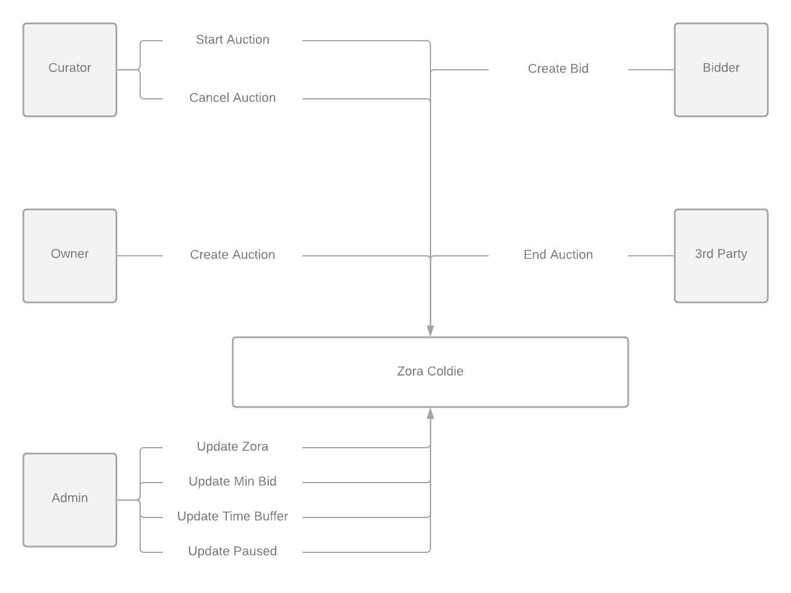
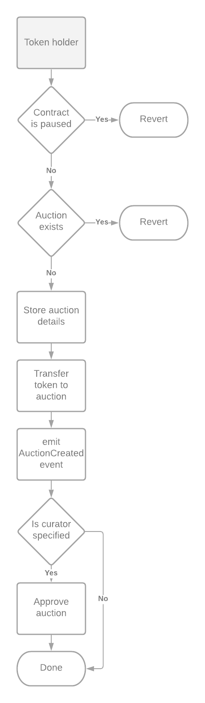
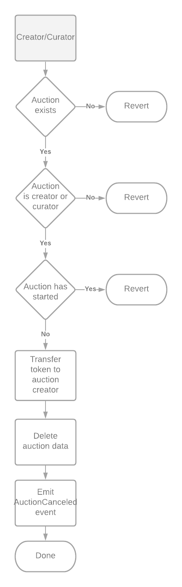
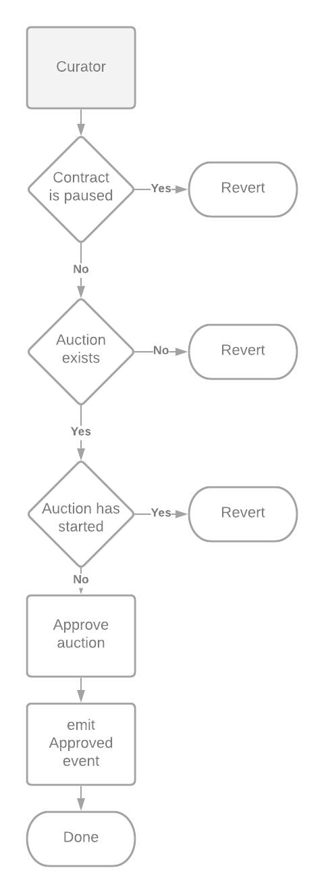
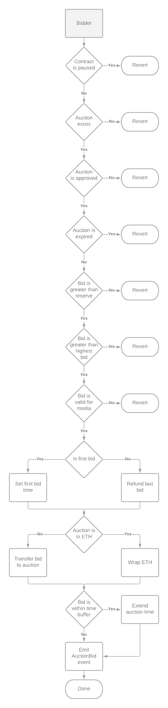
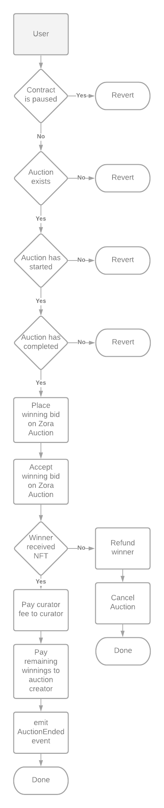

# Zora Coldies

This repository contains the contracts that compose Zora Coldies.

The contracts aim to provide an open system for anyone to perform a coldie auction, with special emphasis given to the role of curators.

Further documentation is available at zora.engineering

## Table of Contents
- [Architecture](#architecture)
  - [Create Auction](#create-auction)
  - [Cancel Auction](#cancel-auction)
  - [Set Auction Approval](#set-auction-approval)
  - [Create Bid](#create-bid)
  - [End Auction](#end-auction)
- [Local Development](#local-development)
  - [Install Dependencies](#install-dependencies)
  - [Compile Contracts](#compile-contracts)
  - [Run Tests](#run-tests)

## Architecture
This protocol allows a holder of a Zora NFT to create and perform
a permissionless coldie auction. It also acknowledges the role of
curators in auctions, and optionally allows the auction creator to 
dedicate a portion of the winnings from the auction to a curator of their choice.

Note that if a curator is specified, the curator decides when to start the auction. 
Additionally, the curator is able to cancel an auction before it begins.

The protocol's general architecture is shown below. Note that once this protocol's 
architecture is finalized, the administrative functions will be removed.

 

### Create Auction
At any time, the holder of a token can create an auction. When an auction is created,
the token is moved out of their wallet and held in escrow by the auction. The owner can 
retrieve the token at any time, so long as the auction has not begun. 

| **Name**               | **Type**       | **Description**                                                                                |
|------------------------|----------------|------------------------------------------------------------------------------------------------|
| `tokenId`              | `uint256`      | The tokenID to use in the auction                                                              |
| `duration`             | `uint256`      | The length of time, in seconds, that the auction should run for once the reserve price is hit. |
| `reservePrice`         | `uint256`      | The minimum price for the first bid, starting the auction.                                     |
| `creator`              | `address`      | The address of the current token holder, the creator of the auction                            |
| `curator`              | `address`      | The address of the curator for this auction                                                    |
| `curatorFeePercentage` | `uint8`        | The percentage of the winning bid to share with the curator                                    |
| `auctionCurrency`      | `address`      | The currency to perform this auction in, or 0x0 for ETH                                        |



### Cancel Auction
If an auction has not started yet, the curator or the creator of the auction may cancel the auction, and remove it from the registry. 
This action returns the token to the previous holder.

| **Name**               | **Type**       | **Description**                                                                                |
|------------------------|----------------|------------------------------------------------------------------------------------------------|
| `tokenId`              | `uint256`      | The tokenID to cancel the auction for                                                          |



### Set Auction Approval
If a created auction specifies a curator to start the auction, the curator _must_ approve it in order for it to start.
This is to allow curators to specifically choose which auctions they are willing to curate and perform.

| **Name**               | **Type**       | **Description**                                                                                |
|------------------------|----------------|------------------------------------------------------------------------------------------------|
| `tokenId`              | `uint256`      | The tokenID for the auction approval                                                           |
| `approved`             | `bool`         | The approval state to set on the auction                                                       |



### Create Bid
If an auction is approved, anyone is able to bid. The first bid _must_ be greater than the reserve price. 
Once the first bid is successfully placed, other bidders may continue to place bids up until the auction's duration has passed.

If a bid is placed in the final 15 minutes of the auction, the auction is extended for another 15 minutes. 

| **Name**               | **Type**       | **Description**                                                                                |
|------------------------|----------------|------------------------------------------------------------------------------------------------|
| `tokenId`              | `uint256`      | The tokenID to place a bid on                                                                  |
| `amount`               | `uint256`      | The amount of currency to bid. If the bid is in ETH, this must match the sent ETH value        |



### End Auction
Once the auction is no longer receiving bids, Anyone may finalize the auction.
This action transfers the NFT to the winner, places the winning bid on the piece, and pays out the auction creator and curator.

| **Name**               | **Type**       | **Description**                                                                                |
|------------------------|----------------|------------------------------------------------------------------------------------------------|
| `tokenId`              | `uint256`      | The tokenID for the ending auction                                                             |



## Local Development
The following assumes `node >= 12`

### Install Dependencies

```shell script
yarn
```

### Compile Contracts

```shell script
npx hardhat compile
```

### Run Tests

```shell script
npx hardhat test
```